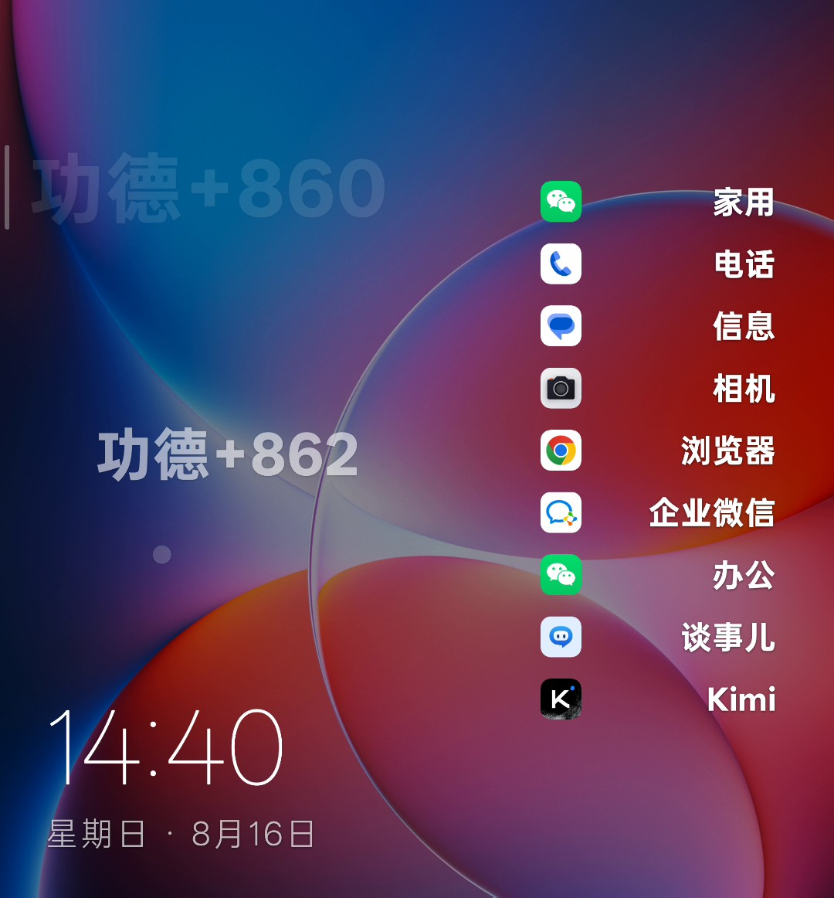
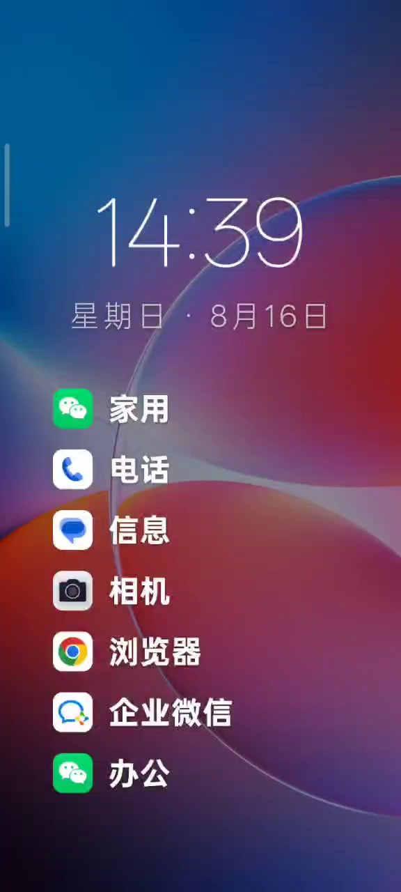

<div align="center">

# 📱 MyLauncher

**A Zune/Metro-style minimal Android launcher**

White-on-color sharp wallpaper · oversized thin clock · monochrome icons with a bold vertical app list — adaptive in both portrait and landscape.

🌍 **Global speed leaderboard** — knock the wooden fish as fast as you can, upload your taps/sec, and race players worldwide. Beat a record and challenge your friends with a share card.

[简体中文](README_CN.md)

[](https://kotlinlang.org)
[](https://developer.android.com/jetpack/compose)
[](https://github.com/theBigGavin/mylauncher)

🏠 **Made by Gavin's Lab** — a one-person company run by 7 AI agents on a kanban board: [company site](https://www.hermes.cc.cd) · [live transparency office](https://www.hermes.cc.cd/opc/)

</div>



## ✨ Features

- **🏆 Global speed leaderboard** — the signature viral feature: knock the wooden fish 10+ times to unlock upload, then race the world on a global top-10 board (auto-generated nickname, editable anytime; your entries highlighted; your rank shown). Breaking a record pops a congrats dialog with your percentile vs. all players — one tap to share to the board, one tap to generate a share card with a download QR code. Privacy: only nickname + speed are uploaded, no device identifiers.
- **🖼️ Speed share image** — a Canvas-drawn 1080×1440 share card (same color palette as the wallpaper): brand + fastest speed big number + nickname + daily peak merit + download QR (ZXing), auto-saved to MediaStore (no permission on Android 10+) with system share. Text follows the current locale.
- **🏠 System launcher (HOME)** — Registered as a system launcher (`fullUser` orientation) with fully adaptive portrait/landscape layouts. Portrait: a centered thin large clock with a vertical app list. Landscape: clock bottom-left, app icons in one vertical line, names right-aligned.
- **📱 Up to 20 apps on the home screen** — with a bottom counter and scrolling; first launch preloads common apps (camera / browser / gallery / settings / WeChat / Kimi / DeepSeek…, matched by package name + label).
- **🧹 Smart filtering** — icon-less, UI-less system shell apps are auto-filtered; the app drawer and picker can toggle "show system apps".
- **⚪ Monochrome icons** — real app icons converted to pure-white monochrome (brightness → alpha), with in-memory + on-disk dual caching.
- **📋 Long-press menu** — replace app (full picker, same style as the home screen) / rename / remove.
- **🔄 Drag to reorder** — long-press then drag for custom ordering, persisted via DataStore.
- **🎛️ Live-adjustable settings** — long-press blank space to open settings: icon size and font size adjust in real time, icons can be hidden, set as default home, restore default layout.
- **📂 App drawer** — swipe up from blank space to pull out the drawer, tap to launch.
- **🖼️ Generative wallpaper** — 62° sharp two-tone diagonal bands + fine lines + hard-edge rings, drawn directly on Canvas (no blur, no bitmap).
- **🪬 Merit wooden fish easter egg** — tap the screen edge to knock (real sound, rapid-fire friendly); each edge knock or completed back gesture adds +1 merit with a rising bubble. Customizable merit text (default "功德"), optional auto-accumulate: +1 every second for a configurable continuous duration (10s–600s, default 10s), then the switch turns itself off. Stats shown in settings: fastest knock rate and all-time peak daily merit. Daily merits are persisted locally, 365-day history.
- **🔔 Notification badges** — after granting system "notification access", per-package notification counts are shown as badges (toggleable in settings).

## 📸 Screenshots



## 🚀 Build & install

**Prerequisites**: JDK 17 + Android SDK (compileSdk 35, minSdk 26).

```bash
./gradlew :app:assembleDebug
adb install -r app/build/outputs/apk/debug/app-debug.apk
```

**Tech stack**: pure Kotlin 2.0 + Jetpack Compose, single `:app` module, package `com.mylauncher`. All UI is self-drawn (no Material dependency).

## 📦 Releases

APKs are published on the [Releases page](https://github.com/theBigGavin/mylauncher/releases) — the latest is **v1.8.2**. Versioning follows semantic versioning `major.minor.patch` (major = breaking change / milestone, minor = new feature, patch = bug fix); `versionCode` increments monotonically with every release.

> ⚠️ **Feature freeze (2026-08-30, OPC governance [0830-gov-3])** — MyLauncher is in **maintenance-only mode**: no *new features* until further notice. Bug fixes, security patches, and release engineering (versionCode bumps, release builds) continue; the launcher stays usable and on the store. [gold-monitor](https://github.com/theBigGavin/gold-monitor) remains active as the req-001 paid hook.

## 🗂️ Project structure

```
app/src/main/java/com/mylauncher/   # Source code (data / icons / ui)
design/                             # Mockups & render scripts (mockup.html is an interactive prototype)
docs/                               # Notes & screenshots
```

## 🔗 Share & attribution

When sharing MyLauncher through external channels, use the short link with UTM parameters so we can trace where the stars come from:

- Short link: https://www.hermes.cc.cd/go/mylauncher
- Trackable target: `https://github.com/theBigGavin/mylauncher?utm_source=shortlink&utm_medium=signature&utm_campaign=mylauncher`

If you post directly instead of using the short link, append the matching `utm_source` to the repo URL:

| Channel | Recommended share URL |
|---|---|
| dev.to | `https://github.com/theBigGavin/mylauncher?utm_source=devto&utm_medium=comment&utm_campaign=mylauncher-launch` |
| v2ex | `https://github.com/theBigGavin/mylauncher?utm_source=v2ex&utm_medium=comment&utm_campaign=mylauncher-launch` |
| juejin | `https://github.com/theBigGavin/mylauncher?utm_source=juejin&utm_medium=comment&utm_campaign=mylauncher-launch` |
| reddit | `https://github.com/theBigGavin/mylauncher?utm_source=reddit&utm_medium=post&utm_campaign=mylauncher-launch` |
| signature / profile | `https://github.com/theBigGavin/mylauncher?utm_source=shortlink&utm_medium=signature&utm_campaign=mylauncher` |

If this launcher makes you smile, a star is the cheapest merit you'll ever earn.

## 🤝 Contributing

Issues and PRs are welcome — this is an open, transparent one-person company built in public.
